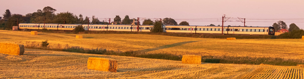
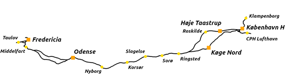

# Denmark 2024 - A freeware route for Open Rails

[![CC BY-NC-SA 4.0][cc-by-nc-sa-shield]][cc-by-nc-sa]

A work in progress freeware route for the [Open Rails simulator](https://www.openrails.org/) based on the danish rail network in 2024 (with some future changes cherry-picked).

The route is currently in a state where the track layout is mostly done, but otherwise it is very unfinished.

The aim for v1.0 is to build the mainline between Fredericia and Copenhagen. Including the new Ringsted-Vigerslev high speed railway line, the great belt fixed link and the old little belt bridge.

The route will also contain the following railway projects under construction in 2024 as if they were already finished:
- The new high speed railway line between Odense and Kauslunde.
- The new DJM depot in Marslev.
- The new IC5 depot in Copenhagen.

## Development of v1.0:

Map of the v1.0 track layout:

- Phase 1:
	- Lay mainline tracks between Fredericia and Copenhagen
- Phase 2: **_(currently at this stage)_**
	- **Rebuild TDB of existing track objects**
	- **Lay track of yards**
	- **Place viaducts/embankments**
	- Place gantry
	- Place milepost signs
	- Place station platforms
	- Place roads and bridges
	- Finish tunnel entrances
- Phase 3:
	- Place interactives (signals / mileposts / speedlimits / platforms / sidings)
	- Place remaining signs
	- Place station scenery
- Phase 4:
	- Place scenery close to the tracks
- Phase 5:
	- Place scenery further away from the tracks

## License:

The route itself and objects/textures named "PGA_\*" are licensed under [CC BY-NC-SA 4.0](https://creativecommons.org/licenses/by-nc-sa/4.0/).

[![CC BY-NC-SA 4.0][cc-by-nc-sa-image]][cc-by-nc-sa]

Blender model files and textures for the objects named "PGA_\*" are available in the [Denmark 2024 objects repository](https://github.com/pgroenbaek/openrails-route-dk24-objects).

All other objects/textures used in this route belong to their respective authors under terms specified by them.

Those objects/textures were obtained from the following freeware packs:
- XTracks 3.20: https://the-train.de/downloads/entry/7920-msts-xtracks-v3-20-files-edition/
- XTracks 3.20 RouteBuilders: https://the-train.de/downloads/entry/7917-msts-xtracks-v3-20-routebuilders/
- NewRoads 4.0: https://the-train.de/downloads/entry/7912-newroads-v4-0-grundversion/?highlight=newroads
- NewRoads 4.0 Autobahn Texturen: https://the-train.de/downloads/entry/7887-newroads-v4-0-autobahn-texturen-update-f%C3%BCr-streckenbauer/
- DBTracks: https://the-train.de/downloads/entry/11252-dbtracks/
- DBTracks Doppelte Kreuzungsweiche: https://the-train.de/downloads/entry/11283-dbtracks-doppelte-kreuzungsweiche-dkw-7-5/
- Danske Signaler: https://www.routebuilders.dk/download/msts/signaler/
- MM Vegetation 7.1: https://the-train.de/downloads/entry/9534-mm-vegetation-v7-1/
- Relæhytter: https://www.routebuilders.dk/download/msts/signaler/
- Dansk overkørsel: https://www.routebuilders.dk/download/msts/signaler/
- Perrontag til Fredericia banegård: https://www.routebuilders.dk/download/msts/bygninger/

Furthermore some objects/textures are from the default MSTS routes by Kuju / Microsoft.

## Credits:

Route created by:
- Peter Grønbæk Andersen

Special thanks to:
- Norbert Rieger (DBtracks, BAB, NR Bahntrasse, Newroads 4.0)
- Piotr Gadecki (developing the TSRE5 route editor)
- Eric Olesen (maintaining the TSRE5 route editor fork)
- Stig Christensen (danish signals)
- All other XTracks 3.20 and Newroads 4.0 authors

Objects and textures by:
- Peter Grønbæk Andersen (anything named "PGA_*")
- Norbert Rieger (tracks, embankments, motorways, bridges, and more)
- Stig Christensen (danish signals, danish level crossings)
- Henrik Fredborg (Fredericia station roof, some danish buildings)
- Manuel Mader (vegetation and trees)
- Laci1959 (double crossing switches)
- Jan Riffel (double crossing switches)
- QJ-6811 (gravel roads)
- Kuju / Microsoft (default MSTS objects)
- Anyone else who I might have missed

Sounds by:
- Jan Riffel (track sounds)

And finally thanks to everyone who has provided good advice on route building, modelling, etc.

[cc-by-nc-sa]: https://creativecommons.org/licenses/by-nc-sa/4.0/
[cc-by-nc-sa-image]: https://licensebuttons.net/l/by-nc-sa/4.0/88x31.png
[cc-by-nc-sa-shield]: https://img.shields.io/badge/License-CC%20BY--NC--SA%204.0-lightgrey?style=flat&logo=creative-commons&logoColor=white