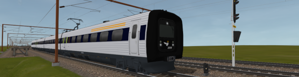

# Denmark 2024 - An OpenRails Freeware Route

A freeware route for the [Open Rails simulator](https://www.openrails.org/) based on the danish rail network in 2024 (with some future changes cherry-picked).

The aim in v1.0 is to build the mainline between Fredericia and Copenhagen.
Including the new high speed railway line between Ringsted and Vigerslev.

The route also contains railway projects under construction in 2024 as if they were already finished, this includes:
- The new high speed railway line between Odense and Kauslunde.
- Electrification north of Fredericia.
- The new DJM depot in Marslev.
- The new IC5 depot in Copenhagen.

## Development of v1.0:
- Phase 1:
	- Lay mainline tracks between Fredericia and Copenhagen
- Phase 2: **_(<- currently at this stage)_**
	- Lay track of yards
	- Bridges
	- Viaducts
	- Embankments
	- Gantry
	- Station platforms
	- Tunnels
- Phase 3:
	- Place signals
	- Place signs
	- Place station scenery
- Phase 4:
	- Scenery close to the tracks
- Phase 5:
	- Scenery further away from the tracks

## Installing:

Requirements to run the route:
- Open Rails 1.4+

To Install:
- Extract the "Denmark 2024" folder from the route zip file into your filesystem.
- Extract the "Denmark 2024" folder from the shapes/textures zip file into the same place.
- Add it as an installation profile in Open Rails.
- Done!

To run the included activities install the following into the "Denmark 2024/TRAINS/TRAINSET" folder:
- DSB IR4 VIA: https://www.trainsim.com/forums/filelib-search-fileid?fid=62938
- DSB IC3 VIA: https://www.trainsim.com/forums/filelib-search-fileid?fid=62942
- CFL MY 1146: https://tog-sim.dk/downloads.php?did=1365
- Alias (Common) Cab & Sound til MY version 3: https://tog-sim.dk/downloads.php?did=1358
- Contec MX 1008: https://tog-sim.dk/downloads.php?did=1053
- Alias (Common) Cab & Sound til MX version 3: https://tog-sim.dk/downloads.php?did=1359
- DSB MZ 1401: https://tog-sim.dk/downloads.php?did=202
- Alias (Common) Cab & Sound til MZ Serie II Version 2: https://tog-sim.dk/downloads.php?did=1360
- DB Hbbins: https://tog-sim.dk/downloads.php?did=1034
- TWA Habiis https://tog-sim.dk/downloads.php?did=1035
- MMP2: https://sites.google.com/site/btsim02/orts/mmp2

## License:

The route itself and all objects/textures named "PGA_*" are licensed under CC BY-NC-SA 4.0.

Details about CC BY-NC-SA 4.0 here: https://creativecommons.org/licenses/by-nc-sa/4.0/deed.en

All other objects/textures used in this route belong to their respective authors under terms specified by them.

These objects/textures are from the following freeware packs:
- XTracks 3.20: https://the-train.de/downloads/entry/7920-msts-xtracks-v3-20-files-edition/
- XTracks 3.20 RouteBuilders: https://the-train.de/downloads/entry/7917-msts-xtracks-v3-20-routebuilders/
- NewRoads 4.0: https://the-train.de/downloads/entry/7912-newroads-v4-0-grundversion/?highlight=newroads
- NewRoads 4.0 Autobahn Texturen: https://the-train.de/downloads/entry/7887-newroads-v4-0-autobahn-texturen-update-f%C3%BCr-streckenbauer/
- DBTracks: https://the-train.de/downloads/entry/11252-dbtracks/
- Danske Signaler: https://www.routebuilders.dk/download/msts/signaler/
- New swedish signals version 0.2: https://www.banbyggarna.se/msts/Signaler.htm
- Swedish Gantrys with Lod version 1.1: https://www.banbyggarna.se/msts/Objekt_1.html
- Deutsches Eisenbahnsignalpaket: https://the-train.de/downloads/entry/8282-deutsches-eisenbahnsignalpaket/
- Signalsystem DennisK. 1.1b im OpenRails: https://the-train.de/downloads/entry/210-signalsystem-dennisk-1-1b-im-openrails/
- MM Vegetation 7.1: https://the-train.de/downloads/entry/9534-mm-vegetation-v7-1/
- Relæhytter: https://www.routebuilders.dk/download/msts/signaler/
- Dansk overkørsel: https://www.routebuilders.dk/download/msts/signaler/
- Perrontag til Fredericia banegård: https://www.routebuilders.dk/download/msts/bygninger/

## Credits:

Route created by:
- Peter Grønbæk Andersen

Special thanks to:
- Piotr Gadecki (TSRE5 route editor)
- Eric (maintaining the TSRE5 route editor fork)
- Norbert Rieger (DBtracks, BAB, NR Bahntrasse, Newroads 4.0)
- Stig Christensen (Danish signals)
- Mats Abramson (Swedish signals)
- Dennis Kunz (German signals)
- All the other XTracks 3.20 and Newroads 4.0 authors

Objects and textures by:
- Peter Grønbæk Andersen (everything named "PGA_*")
- Norbert Rieger (tracks, embankments, motorways, bridges, and more)
- Stig Christensen (danish level crossings)
- Henrik Fredborg (Fredericia station roof, some danish buildings)
- Manuel Mader (vegetation)
- Anders Svensson (swedish gantry)
- Daniel Harms (german level crossings)
- Kuju / Microsoft (default MSTS objects)
- Anyone who I forgot to add to this list

Sounds by:
- Jan Riffel
- Icki81

## Potential future expansions:

Eventually more of the danish rail network might be added. In particular the mainlines.

Although, with some future additions and changes cherry-picked.
In particular projects under construction in 2024, i.e:
	- The new fehmern tunnel railway line
	- The new storstrøms bridge
	- Electrification from Næstved through to the fehmern tunnel
	- The new depot in Næstved

Expansion Steps:
- v2.0: Additional Mainlines,
	- Fredericia - Århus
	- Århus - Aalborg
	- Taulov - Padborg
	- Padborg - Flensburg
	- Kastrup - Malmö - Lund
	- Klampenborg - Helsingør
	- Lunderskov - Esbjerg
	- Ringsted - Nykøbing F.
	- Nykøbing F. - Lübeck
- v3.0+: Potential branchline and s-tog additions,
	- Branchlines:
		Tinglev - Sønderborg
		Odense - Svendborg
		Struer - Vejle
		Kalundborg - Roskilde
		Næstved - Køge - Roskilde
		Slagelse - Tølløse
		Holbæk - Nykøbing Sj.
		Køge - Faxe Ladeplads - Rødvig
		Helsingør - Hillerød
		Hillerød - Snekkersten
		Hillerød - Hundested
		Hillerød - Tisvildeleje
		Bramming - Tønder - Niebüll
		Herning - Skanderborg
		Struer - Langå
		Esbjerg - Nørre Nebel - Skjern
		Skjern - Herning
		Skjern - Holstebro
		Struer - Thisted
		Vemb - Lemvig - Thyborøn
		Aalborg - Frederikshavn
		Frederikshavn - Skagen
		Hjørring - Hirtshals
	- Copenhagen S-train lines:
		Hellerup - Jægersborg - Nærum
		Ny Ellebjerg - Køge
		Vigerslev - Svanemøllen
		Valby - Frederikssund
		Ryparken - Farum
		Jægersborg - Hillerød
